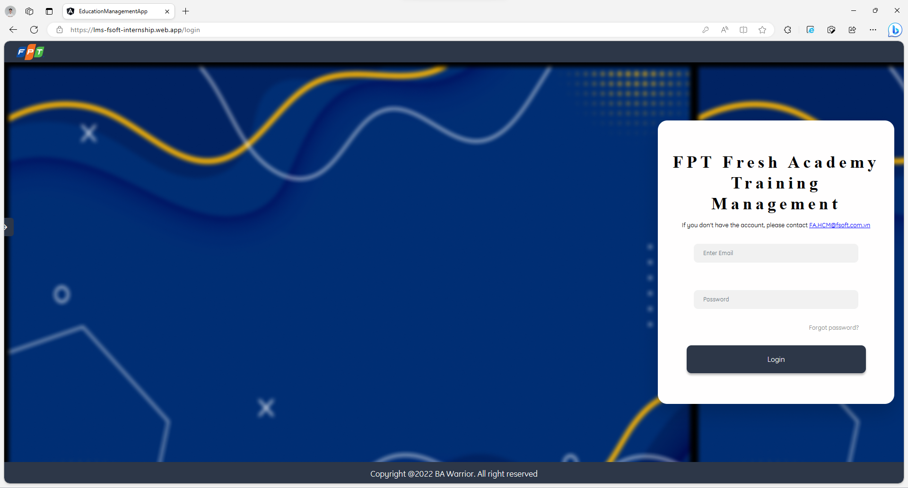
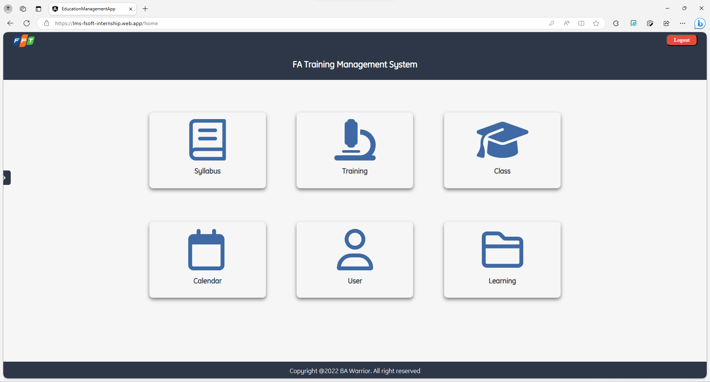
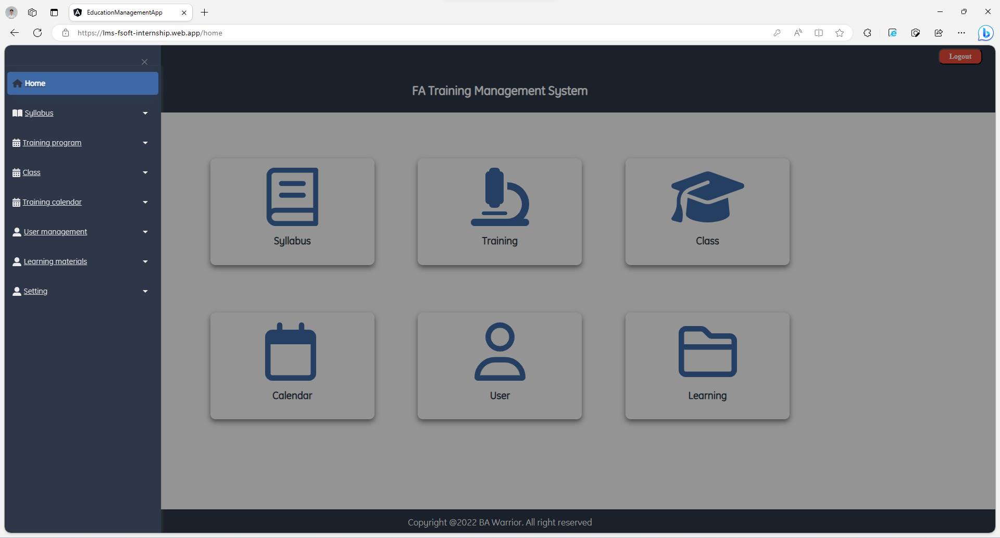
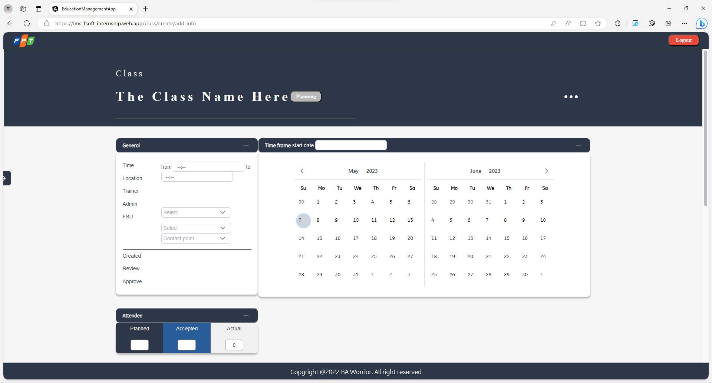

# Education Management Web Application

:wave: Welcome to our Project in the internship (term Spring 2023) at FPT Software :wave:

## Table of Contents

- [Education Management Web Application](#education-management-web-application)
  - [Table of Contents](#table-of-contents)
  - [Description](#description)
  - [Preview Screenshot](#preview-screenshot)
  - [Technology](#technology)
  - [Functional requirements](#functional-requirements)
  - [Useful Resources](#useful-resources)
  - [Contributors](#contributors)
  - [References](#references)
    - [Development server](#development-server)
    - [Code scaffolding](#code-scaffolding)
    - [Build](#build)
    - [Running unit tests](#running-unit-tests)
    - [Running end-to-end tests](#running-end-to-end-tests)
    - [Further help](#further-help)
    - [Some Code](#some-code)
  - [License \& Copyright](#license--copyright)

## Description

- This is a MOCK project to practice Angular knownledge.
- This application is used for Fresher Academy to support create and management classes easily.
  This website helps the operation staff of FA in managing and scheduling classes, with features as follow: - Create and manage the syllabus's content. - Create and manage training program. - Plan and manage classes. - Report classes by week, quarter.
- This web works well on desktop, not for mobile.
- This project started from 20-02-2023 to 10-04-2023.

## Preview Screenshot

<div align="center">
</img><br></br>
Demo clip: https://youtu.be/PppfskgZD9w
<br></br>
  </img>
  </img> &nbsp;&nbsp; 
  </img>
  </img> &nbsp;&nbsp; 
</div>
  
## Technology
**1. Frontend**
  - Angular

**2. Backend**

- .NET

**3. Database**

- Microsoft SQL Server

**4. Tool**

- VSCode

## Functional requirements

**1. Super admin:**

- [x] Login by provided username and password
- [x] Create Classes
- [x] Search, Sort, and Filter Syllabus
- [x] Search, Sort, and Filter Training programs
- [x] Search, Sort, and Filter Classes
- [ ] Create Syllabus
- [ ] Create Training programs

**2. Class admin**

- [x] View tables

**3. Trainee:**

- [x] View tables

## Useful Resources

| #   | #   | Name                                                                                                                                                                                        | Description                                                                  |
| --- | --- | ------------------------------------------------------------------------------------------------------------------------------------------------------------------------------------------- | ---------------------------------------------------------------------------- |
| 1   | -   | [Mock Project](https://gitlab.com/react03_project-lms/fsoft-intern-mock-project.git)                                                                                                 | Source code                                                                  |
| 2   | -   | [Figma screens](https://www.figma.com/file/kDwGDytWfYhhW3zb33GeBk/FA_training_system_React03?type=design&node-id=295%3A5993&t=NCGODesuEoO85Gss-1)                                                                      | The given screen design on Figma                                            |
| 3   | -   | [Document Folder](https://fptuniversity-my.sharepoint.com/:f:/g/personal/thongntse160850_fpt_edu_vn/Eg3kv9JoAL5MjF6fnKPoBjkBkzfR7n-uSOrmyCiSrNof0A?e=lspe10)                                                                                  | All of document files (Weekly Report, Product Backlog, SRS, Design Document) |
| 4   | -   | [Presentation Slide](https://www.canva.com/design/DAFiQGHhn5A/LyaGFJEFKNAl6vZSwcyCTQ/edit?utm_content=DAFiQGHhn5A&utm_campaign=designshare&utm_medium=link2&utm_source=sharebutton) | Presentation slide for defense day                                           |

## Contributors

**1. Mentors:**

- Main Mentor: Le Duc Huy (HuyLD6)

**2. Members:**

- [Nguyễn Trung Thông](https://github.com/thongnt0208) - SE160850 - **Team Leader | UI Designer | Front-end Developer**
- [Lê Cáp Ngọc Long](https://github.com/thongnt0208) - SE150508 - **Front-end Developer**
- [Trần Kim Đạt](https://github.com/thongnt0208) - SE162102 - **Front-end Developer**
- [Huỳnh Khánh](https://github.com/thongnt0208) - CE150703 - **Front-end Developer**
- [Trần Hoàng Duy](https://github.com/thongnt0208) - CE150011 - **Front-end Developer**
- [Nguyễn Minh Nhựt](https://github.com/thongnt0208) - CE160255 - **Front-end Developer**

**3. Detail task:**
| # | Name | Screens |
|:-:|:--------------------:|:---------------------------------------------------------------------------------------------------------------------------------------------------------------------------------------------------------------------------------------------------------------:|
| 1 | Nguyễn Trung Thông | Create Class - add name, Create Class - add program, Create Class - tooltip1, Create Class - tooltip2, Create Class - add info, Create Class - add trainer, Create Class - view syllabus |
| 2 | Lê Cáp Ngọc Long | Import Syllabus, Create Training Program - import, Create Training Program - name, Create Training Program - syllabus, Create Training Program - general, User management - general, User management - permission |
| 3 | Trần Kim Đạt | List of Class - general, List of Class - filter, Class details - general, Training Calendar - general by day, Training Calendar - general by week, Training Calendar - filter, Training Calendar - week with search |
| 4 | Huỳnh Khánh | List of Syllabus, Syllabus details - general, Syllabus details - outline, Syllabus details - other, Create Class - add syllabus, Create Class - create syllabus |
| 5 | Trần Hoàng Duy | List of Training Programs - view programs, List of Training Programs - filter, Training Program detail - general, Training Program detail - detail, Training Program detail - material, User management - import |
| 6 | Nguyễn Minh Nhựt | Login, Forgot password, Create Syllabus - general, Create Syllabus - outline, Create Syllabus - other, User management - search |

## References

<details>
    <summary>Angular CLI:</summary>
  This project was generated with [Angular CLI](https://github.com/angular/angular-cli) version 15.1.2.

### Development server

Run `ng serve` for a dev server. Navigate to `http://localhost:4200/`. The application will automatically reload if you change any of the source files.

### Code scaffolding

Run `ng generate component component-name` to generate a new component. You can also use `ng generate directive|pipe|service|class|guard|interface|enum|module`.

### Build

Run `ng build` to build the project. The build artifacts will be stored in the `dist/` directory.

### Running unit tests

Run `ng test` to execute the unit tests via [Karma](https://karma-runner.github.io).

### Running end-to-end tests

Run `ng e2e` to execute the end-to-end tests via a platform of your choice. To use this command, you need to first add a package that implements end-to-end testing capabilities.

### Further help

To get more help on the Angular CLI use `ng help` or go check out the [Angular CLI Overview and Command Reference](https://angular.io/cli) page.

### Some Code

```js
function logSomething(something) {
  console.log("Something", something);
}
```

</details>

## License & Copyright

&copy; 2023 Group1-HCM23_CPL_React_03
